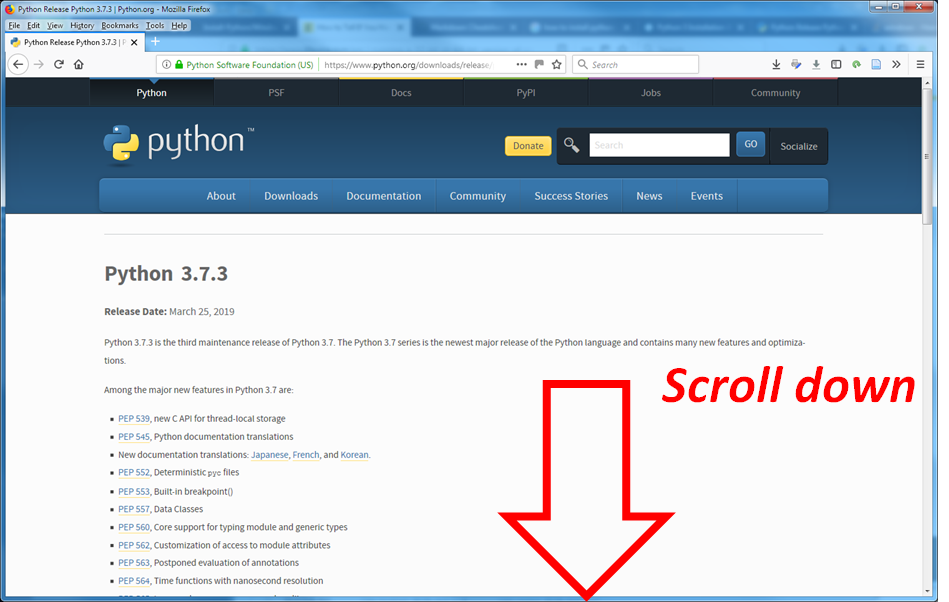
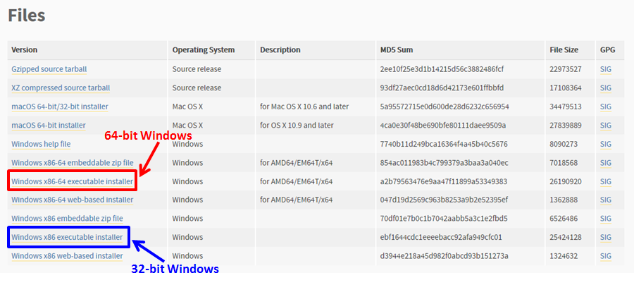
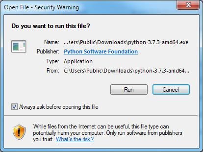

## Instructions for installing Python on a Windows computer

### 1. Find out if your Windows Operating System is 32-bit or 64-bit

It is important to know this before choosing which Python file to download from the internet.

*Windows 7:* 

Press the Windows key, then type "Control Panel". From the list of possible options click on Control Panel.

When the Control Panel opens if there is an item called "System" then click on this. 

If there isn't an icon called "System" but there is a category called "System and Security" then click on this then click on "System" in the new display.

For Windows 7 the display will look like this:

The item labelled "System type:" will show you whether your operating system is 32-bit or 64-bit.

*Windows 8 or 10:* 

Press the Windows key, then type "Control Panel". From the list of possible options click on Control Panel Desktop App.

When the Control Panel opens if there is an item called "System" then click on this. 

If there isn't an icon called "System" but there is a category called "System and Security" then click on this then click on "System" in the new display.

For Windows 7 the display will look like this:

The item labelled "System type:" will show you whether your operating system is 32-bit or 64-bit.

### 2. Go to the Python Releases for Windows download web page

Click on this link to go to the Python download page. The best option is to hold down the Ctrl key while clicking. This will open the Python page in a new tab and leave these instructions available to go back to.

[https://www.python.org/downloads/windows/](https://www.python.org/downloads/windows/)

Here is what the link looks like:

From the two options at the top of the page select the one called "Latest Python 3 Release"

In this example the latest Python version is 3.7.3, but this might be different if you download Python later.

The link will go to a page which looks like this (again, the version number might not be 3.7.3):

Scroll down until you find a section headed **Files**

Choose the file depending on whether your operating system is 32-bit or 64-bit and click on the link. The file will either start downloading straight away into your Downloads folder, or you may be asked where on your computer you want to save the file. Choose where to save it, then click OK.

### 3. Run the installation program

Open Windows Explorer (if you have Windows 7) or File Explorer (if you have Windows 8 or 10) and navigate to the place where the Python installation file has been saved. Double click on this file to start the installation.

You will probably see a window like this:

